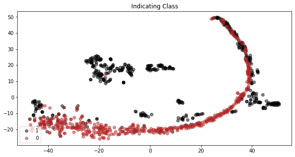
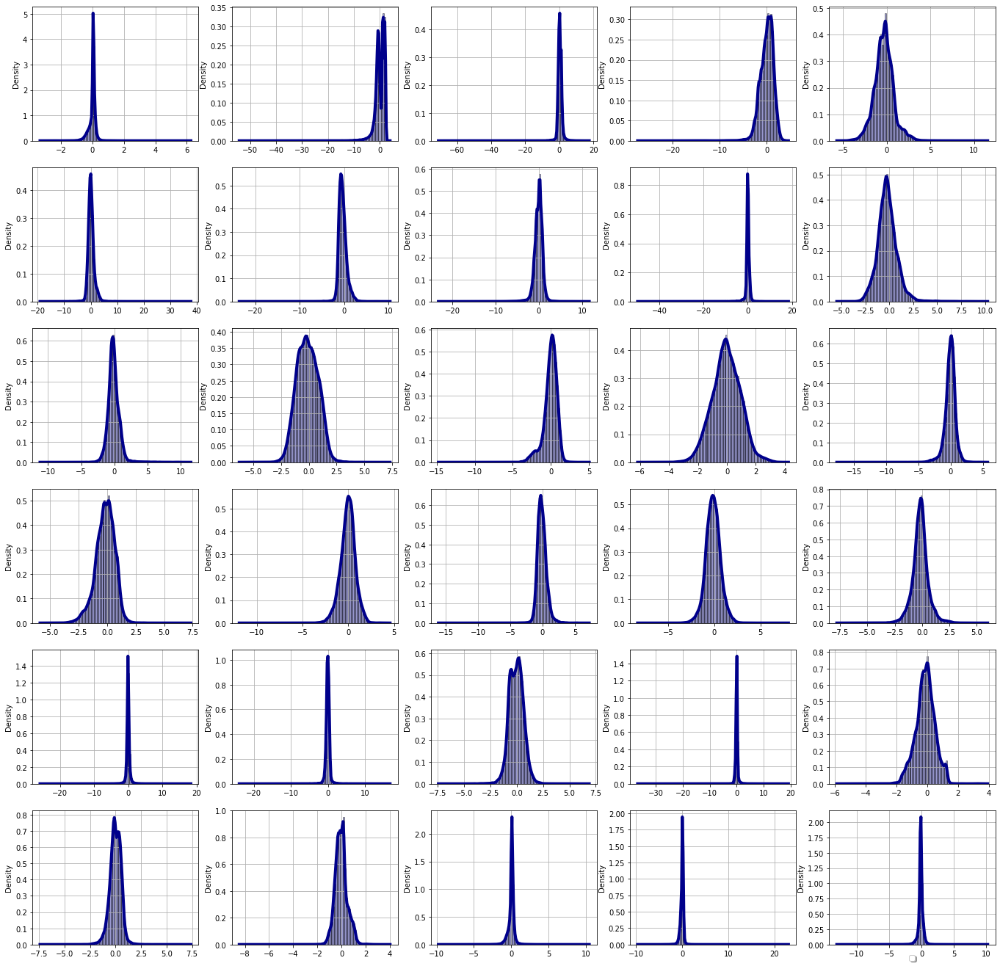
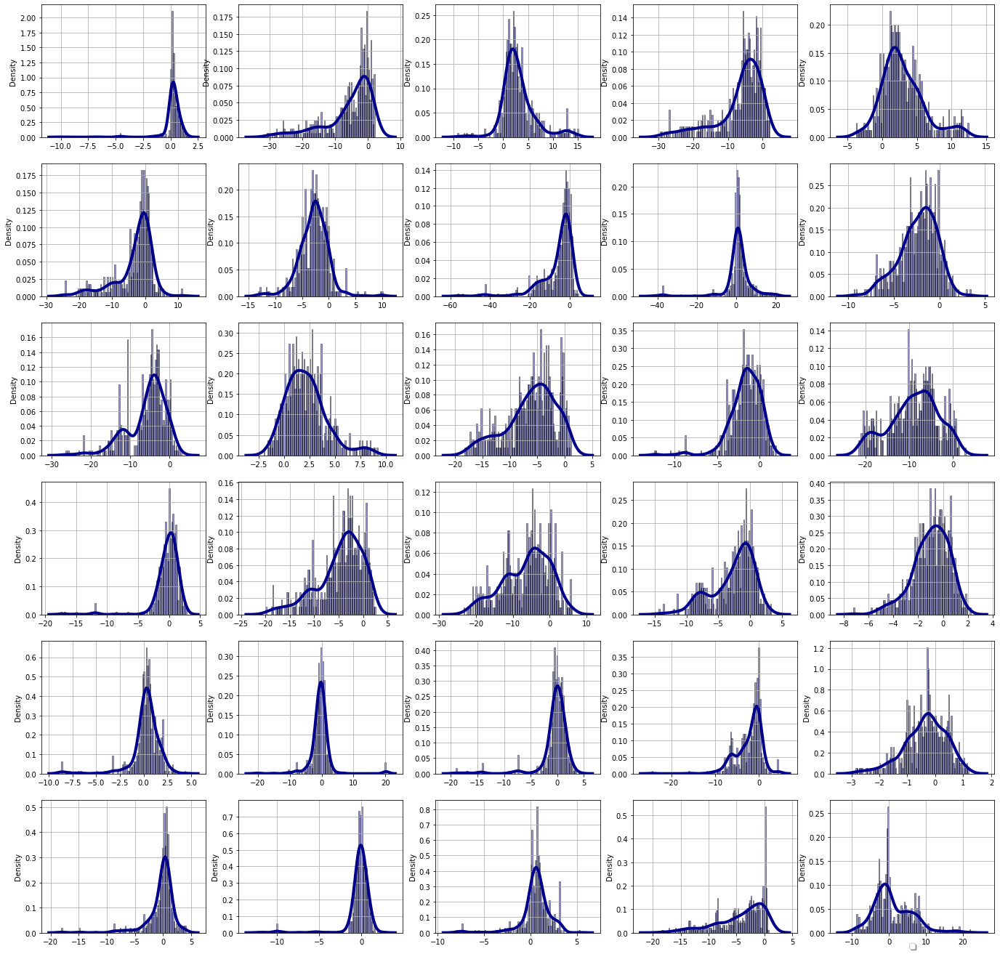

# Anomaly Detection with Auto-Encoders

In this project, we perform an Unsupervised Learning Algorithm with Auto-Encoders for Anomaly Detection.

Using a credit card Fraud transactions dataset, we firstly train auto-encoders to learn Legit transactions, and next we test
the model on out-of-sample Legit and Fraud transactions. As it was expected, the model gives high penalty to Fraud transactions,
and small penalty to Legit transactions.

## Dependencies
* Install anaconda3

* Activate virtual enviroment
```angular2
sudo pip install --upgrade virtualenv
mkdir venvs
virtualenv my_venv
source my_venv/bin/activate
```

* Install python libraries
```angular2
pip install -r requirements.txt
```

## Data

#### Download CreditCard Fraud data
We are using a typical Kaggle CreditCard Fraud dataset [FraudData](https://www.kaggle.com/datasets/mlg-ulb/creditcardfraud)
Download data and move `creditcard.csv` to the "data" folder of this project
```js
pip install kaggle --upgrade
kaggle datasets download -d mlg-ulb/creditcardfraud
unzip creditcardfraud.zip
mv creditcardfraud.csv data/
```


## Processes

### Fraud Explanatory Analysis
Before start modeling, we firstly vizualise the explanatory power of our features.
#### Run clustering analysis (`notebooks/clustering.ipynb`)
In this notebook, we perform the following steps
- **Preprocessing:** Read dataset, undersample majority class, and create features.
- **Clustering:** We perform Agglomerative Hierarchical Clustering. Even though this algorithm has slow convergence, 
our dataset is small enough, we prefer this algorithm as a result of more interpretable and informative hierarchical clustering’s dendrogram.
Finally, as long as we have Fraud data, we will have a prior belief of two clusters, and we will not proceed to any algorithm to determine the number of clusters (elbow method)
or measure the wellness of clusters (silhouette metric etc).
- **Dimensionality reduction - Feature projection:** Next, in order to visualize our features against our target variables, 
and evaluate the explanatory power of our features, we perform a TSNE dimensionality reduction algorithm. Thus, we project 30 features, to a 2-D space.
- **Explanatory power visualization:** Finally, we can clearly see that our features create distinguished areas of Fraud and non-Fraud users.



### Anomaly detection
Following the steps of code usage to produce all results.
####  Run preprocessing (`src/preprocessing.py`)
This script reads dataset, creates features, and finally train Legit Data, test Legit data and test Fraud Data.
```js
cd src/
python  preprocessing.py
```
#### Run evaluation (`src/evaluate.py`)
This script reads the preprocessed datasets. Next, given a set of hyper-parameters, we fit the train and predict the test data, and evaluate the performance of an
Unsupervised Learning Algorithm with Auto-Encoders for Anomaly Detection. To that respect we calculate the reconstruction mse for the Legit and Frad test data.
```js
cd src/
python3 evaluate.py
```
Results for test sample

|  | MSE   |
|-----------|-------|
| Legit     | 0.80  |
| Fraud     | 27.86 |

### Anomaly Detection Analysis
#### Run evaluation analysis (`notebooks/evaluation.ipynb`)
In this notebook, we vizualise the difference of the reconstruction of the 30 input Features with the input Features.
We plot the histogram for both Legit and Fraud Features.

##### Legit distributions

##### Fraud distributions
